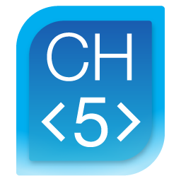

# cra-template-crestron-ch5-typescript

<div align="center">
 
 
</div>

---

[](https://github.com/Norgate-AV-Solutions-Ltd/cra-template-crestron-ch5-typescript/actions/workflows/main.yml)
[](https://conventionalcommits.org)
[](http://commitizen.github.io/cz-cli/)
[](#contributors)
[](https://www.npmjs.com/package/@norgate-av/cra-template-crestron-ch5-typescript)
[](LICENSE)

---

An unofficial third party TypeScript template for [Create React App](https://github.com/facebook/create-react-app) and [Crestron CH5](https://www.npmjs.com/package/@crestron/ch5-crcomlib).

Setup to work with Crestron CH5 out of the box so you can get up and running quickly. It provides packages for page routing, styling using [CSS-in-JS](https://en.wikipedia.org/wiki/CSS-in-JS) and/or [TailwindCSS](https://tailwindcss.com/) (you can still use regular CSS, SCSS or even [CSS Modules](https://create-react-app.dev/docs/adding-a-css-modules-stylesheet/) 😄), a wide variety of icons, mobile browser console, linting and more... 🚀 🚀 🚀

<!-- START doctoc generated TOC please keep comment here to allow auto update -->
<!-- DON'T EDIT THIS SECTION, INSTEAD RE-RUN doctoc TO UPDATE -->

## Contents 📖

-   [Features :white_check_mark:](#features-white_check_mark)
-   [Inside the Box :package:](#inside-the-box-package)
-   [Getting Started :rocket:](#getting-started-rocket)
-   [Enable Husky Git Hooks :dog:](#enable-husky-git-hooks-dog)
-   [Project Configuration :zap:](#project-configuration-zap)
-   [Team :soccer:](#team-soccer)
-   [Contributors :sparkles:](#contributors-sparkles)
-   [Learn More :books:](#learn-more-books)
-   [LICENSE :balance_scale:](#license-balance_scale)

<!-- END doctoc generated TOC please keep comment here to allow auto update -->

## Features :white_check_mark:

-   ✅ Works with [Crestron CH5 CrComLib](https://www.npmjs.com/package/@crestron/ch5-crcomlib) out of the box.
    -   No need to manually edit the CrComLib `package.json` 👍
-   ✅ React v18 Ready
-   ✅ Eruda Setup
-   ✅ Basic Redux Setup
-   ✅ Basic GitHub Actions CI
-   ✅ Multiple Build Options
    -   ✅ React App
    -   ✅ Crestron CH5 Archive (`.ch5z`)
    -   ✅ Docker Image
    -   ✅ Electron App

## Inside the Box :package:

-   [Crestron CH5 CrComLib](https://www.npmjs.com/package/@crestron/ch5-crcomlib)
    -   Crestron HTML5 (CH5) Components Library
-   [Crestron CH5 WebXPanel](https://www.npmjs.com/package/@crestron/ch5-webxpanel)
    -   Browser control of ch5 components library
-   [Crestron CH5 CLI](https://www.npmjs.com/package/@crestron/ch5-utilities-cli)
    -   Crestron CH5 utilities
-   [Crestron CH5 Helper](https://www.npmjs.com/package/@norgate-av/crestron-ch5-helper)
    -   A helper collection of Crestron CH5 constants 😀
-   [Typescript](https://www.typescriptlang.org/)
    -   A superset of JavaScript that compiles to clean JavaScript output
-   [React Router](https://reactrouterdotcom.fly.dev/)
    -   Declarative routing for React
-   [Redux](https://redux.js.org/)
    -   Predictable state container for JavaScript apps
-   [React Redux](https://react-redux.js.org/)
    -   Official React bindings for Redux
-   [Redux Toolkit](https://redux-toolkit.js.org/)
    -   The official, opinionated, batteries-included toolset for efficient Redux development
-   [Styled Components](https://styled-components.com/)
    -   Visual primitives for the component age. Use the best bits of ES6 and CSS to style your apps 💅
-   [TailwindCSS](https://tailwindcss.com/)
    -   A utility-first CSS framework for rapid UI development
-   [clsx](https://www.npmjs.com/package/clsx)
    -   A tiny (228B) utility for constructing className strings conditionally
-   [React Icons](https://react-icons.github.io/react-icons/)
    -   svg react icons of popular icon packs
-   [React Crestron CH5 Hooks](https://www.npmjs.com/package/@norgate-av/react-crestron-ch5-hooks)
    -   A collection of Crestron CH5 hooks ⚓ for React 😀
-   [Rooks](https://react-hooks.org/)
    -   Essential React custom hooks ⚓ to super charge your components!
-   [Eruda](https://eruda.liriliri.io/)
    -   Console for mobile browsers
-   [Axios](https://axios-http.com/)
    -   Promise based HTTP client for the browser and node.js
-   [ESLint](https://eslint.org/)
    -   Find and fix problems in your JavaScript code
-   [Prettier](https://prettier.io/)
    -   An opinionated code formatter
-   [Husky](https://typicode.github.io/husky/#/)
    -   Git hooks made easy 🐶 woof!
    -   **NOTE** This feature needs to be manually enabled. See [here](##enable-husky-git-hooks-dog) for more details.
-   [Lint-Staged](https://github.com/okonet/lint-staged)
    -   🚫💩 — Run linters on git staged files
    -   **Requires** [Husky](##enable-husky-git-hooks-dog) to be enabled.
-   [Commitizen](https://commitizen-tools.github.io/commitizen/)
    -   Create committing rules for projects 🚀 auto bump versions ⬆️ and auto changelog generation 📂
-   [commitlint](https://commitlint.js.org/#/)
    -   📓 Lint commit messages
    -   **Requires** [Husky](##enable-husky-git-hooks-dog) to be enabled.
-   [GitHub Actions CI](https://github.com/features/actions)
    -   Automate your workflow from idea to production
-   [VSCode Workspace Settings](https://code.visualstudio.com/docs/getstarted/settings#_workspace-settings)
-   [EditorConfig](https://editorconfig.org/)
-   [Docker Support](https://www.docker.com/)
    -   Build safer, share wider, run faster
    -   **Requires** [Docker](https://docs.docker.com/get-docker/) and [Docker-Compose](https://docs.docker.com/compose/install/) to be installed on your local machine. [Portainer](https://www.portainer.io/) is also recommended as a front end for managing Docker containers. It is free and open-source.
-   [Electron Support](https://electronjs.org/)
    -   Build cross-platform desktop apps with JavaScript, HTML, and CSS

## Getting Started :rocket:

To use this template, add `--template @norgate-av/crestron-ch5-typescript` when creating a new app.

For example:

```sh
npx create-react-app my-app --template @norgate-av/crestron-ch5-typescript

# or

yarn create react-app my-app --template @norgate-av/crestron-ch5-typescript
```

## Enable Husky Git Hooks :dog:

Currently, to use the Husky Git Hooks feature provided by this template you must manually run the following command within the project directory after the bootstrap completes. This will update the local git configuration to use the hooks in the `.husky` directory.

```sh
npm run husky:install

# or

yarn husky:install
```

## Project Configuration :zap:

To upload to a Crestron touchscreen or control system using the scripts provided by this template, add the IP address or hostname to the project properties in `package.json`.

```json
{
    "crestron": {
        "project": {
            "touchscreen": {
                "url": "Enter IP/Hostname of Crestron Touchpanel here...",
                "type": "touchscreen"
            },
            "web": {
                "url": "Enter IP/Hostname of Crestron Processor here...",
                "type": "web",
                "config": {
                    "host": "localhost",
                    "ipId": "0x03",
                    "roomId": ""
                }
            }
        }
    }
}
```

## Team :soccer:

This project is maintained by the following person(s) and a bunch of [awesome contributors](https://github.com/Norgate-AV-Solutions-Ltd/cra-template-crestron-ch5-typescript/graphs/contributors).

<table>
  <tr>
    <td align="center"><a href="https://github.com/damienbutt"><br /><sub><b>Damien Butt</b></sub></a><br /></td>
  </tr>
</table>

## Contributors :sparkles:

<!-- ALL-CONTRIBUTORS-BADGE:START - Do not remove or modify this section -->

[](#contributors-)

<!-- ALL-CONTRIBUTORS-BADGE:END -->

Thanks go to these awesome people ([emoji key](https://allcontributors.org/docs/en/emoji-key)):

<!-- ALL-CONTRIBUTORS-LIST:START - Do not remove or modify this section -->
<!-- prettier-ignore-start -->
<!-- markdownlint-disable -->
<table>
  <tr>
    <td align="center"><a href="https://github.com/features/security"><br /><sub><b>Dependabot</b></sub></a><br /><a href="#maintenance-dependabot" title="Maintenance">🚧</a></td>
  </tr>
</table>

<!-- markdownlint-restore -->
<!-- prettier-ignore-end -->

<!-- ALL-CONTRIBUTORS-LIST:END -->

This project follows the [all-contributors](https://allcontributors.org) specification.
Contributions of any kind are welcome!

Check out the [contributing guide](CONTRIBUTING.md) for more information.

## Learn More :books:

To learn more, check out the following resources:

-   [Getting Started](https://create-react-app.dev/docs/getting-started) – How to create a new app.
-   [User Guide](https://create-react-app.dev) – How to develop apps bootstrapped with Create React App.
-   [Crestron CH5](https://sdkcon78221.crestron.com/sdk/Crestron_HTML5UI/Content/Topics/Home.htm) - Documentation and resources for developing with Crestron CH5.

## LICENSE :balance_scale:

[MIT](LICENSE)
